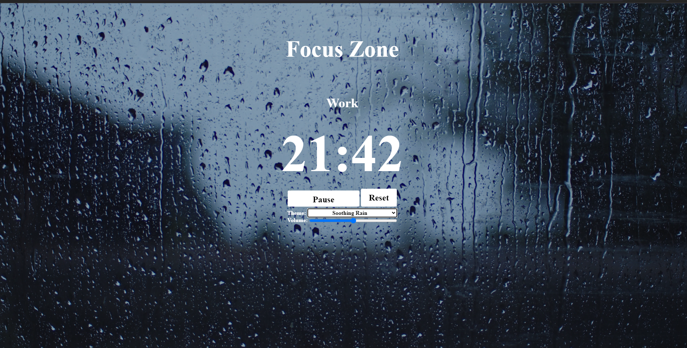
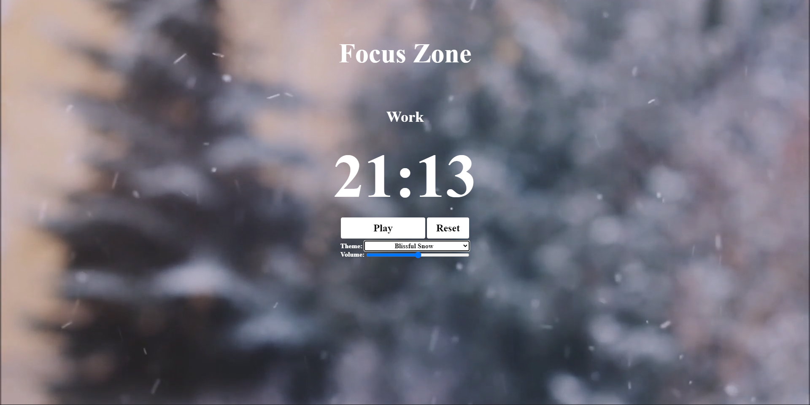
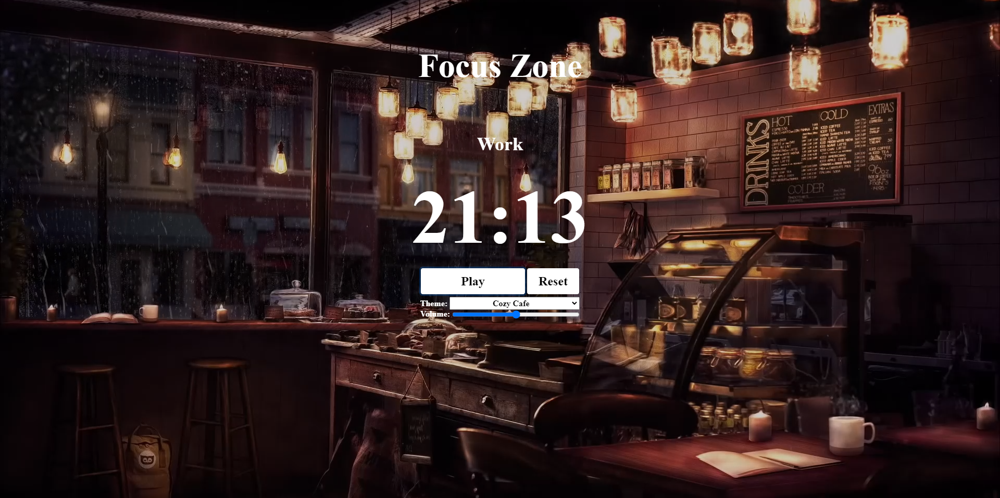
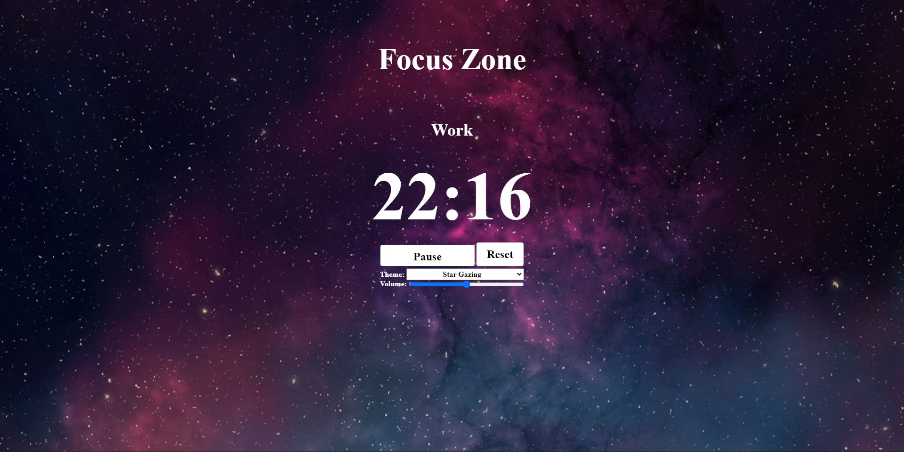

# The Focus Zone
The Focus Zone is a web application designed to improve productivity through the use of the pomodoro technique. Work and break times are split up into 25-5 minute intervals which are displayed with a digital stopwatch. At the moment there are 5 custom themes with unique background videos, and ambient noises aimed to increase focus. It is written using HTML, CSS (Bootstrap), and JavaScript (Vanilla). 

Motivation
===
As a college student I'm always looking for ways to increase my productivity, leading me to the pomodoro technique. Studies have shown that by splitting up large tasks into smaller chunks of uninterrupted focused work, productivity increases greatly. Combine this with ambient background noises, and aesthetically pleasing background videos and you have a recipe for maximum focus. This has led me to create The Focus Zone, a simple web app designed to create a productive and relaxing atmosphere. 

This project is set to serve as one of many widgets in a larger web-application named "ToDo", a project aimed at creating an online tool designed to help students manage their time, and build effective studying habits. This is my first project done using HTML5,CSS and JavaScript.

Features
===
- 25-5 minute work and break intervals.
- Audio indicator when work/break time is done.
- Timer reset and pause functionality.
- Volume control.
- Select from up to 5 themes with custom videos and sounds.

Screenshots
===
- Rain
 </img>
- Snow
 </img>
- Cafe
 </img>
- Space 
 </img>

How to Install and Run
===
1. Download the "vids.zip" from https://www.dropbox.com/s/s1zau8nja3vc9tu/vids.zip?dl=0
2. Unzip the file, and place the folder "vids" into the main directory.
3. Run "timer.html" using a browser of your choice. 

Future Improvments and Current Shortcomings
=== 
1. Add more themes.
2. Make more responsive for smaller devices.
3. Include option to track number of work intervals completed.
4. Allow users to customize length of work/break intervals.
5. Embed a spotify widget (?)

Credits
===
Author: Ronald Chen

